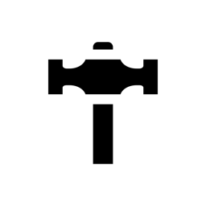
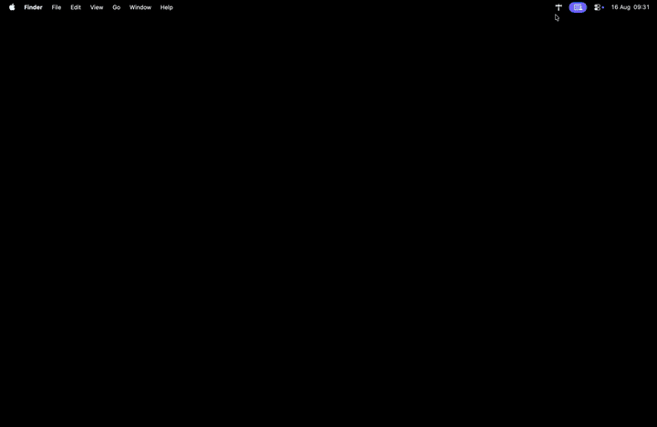
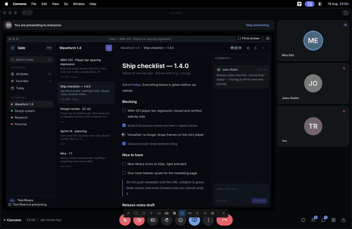
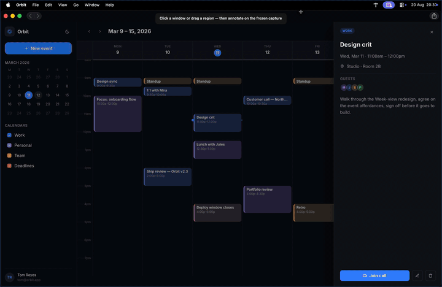

<p align="center">
  
</p>

<h1 align="center">Topkit</h1>

<p align="center">
  <strong>Copy and paste. Present and annotate. Record annotated screenshots and videos.</strong><br>
  A macOS menu bar app with customisable global shortcuts.
</p>

<p align="center">
  <a href="https://apps.apple.com/app/id6761268614"></a>
  <a href="LICENSE"></a>
  
  <a href="https://topkitapp.com/"></a>
</p>

<p align="center">
  <a href="https://apps.apple.com/app/id6761268614">Mac App Store</a> ·
  <a href="https://topkitapp.com/">topkitapp.com</a>
</p>

## Features

### Copy and paste

History for copied text and images. Search and pin items, optional previews and auto-paste after selection. You can export it too.

<p align="center">
  
</p>

### Present and annotate

Draw shapes, freehand, text, stickers, redaction, badges, guides, grids and measurements on top of any app. Always on-screen, across monitors and macOS Spaces. Present with a magnifying glass and halo that follow your cursor. Pick a colour from anywhere on screen and save it in the clipboard.

<p align="center">
  
</p>

### Record annotated screenshots and videos

Screenshot a window or region, annotate it, then copy to clipboard and/or save to a folder. Record a window or region as video. Optional live dictation subtitles burned into the video, and optional microphone audio. Trim and save your video, ready to share.

<p align="center">
  
</p>

Every tool has customisable global shortcuts.

## Install

### Mac App Store

[Get Topkit on the Mac App Store](https://apps.apple.com/app/id6761268614).

### Build from source

**Requirements:** macOS 14+, Xcode 26+.

```sh
git clone https://github.com/taimansulimani/topkit.git
cd topkit
xcodebuild \
  -project Topkit.xcodeproj \
  -scheme Topkit \
  -configuration Release \
  -destination 'platform=macOS' \
  -derivedDataPath build
```

App: `build/Build/Products/Release/Topkit.app`

Or open `Topkit.xcodeproj` in Xcode, select the **Topkit** scheme, and Run.

A build from source is not the same app as the App Store build. It is unsandboxed and signed with your own certificate, so macOS treats it as a separate app: you grant Screen Recording and Accessibility again, and it keeps its own clipboard history instead of reading the one the App Store copy stored. Nothing is deleted, the two copies just do not share storage.

## FAQ

### Which macOS versions does Topkit support?

macOS 14 and later.

### What permissions does Topkit need?

Screen Recording for magnify, screenshots, recording and the colour picker. Microphone and Speech Recognition for recording subtitles. Accessibility for auto-paste.

### What about privacy?

No internet access by design. No login, no data collection, no telemetry, no ads. Everything stays local.

### Where does clipboard history live, and is it encrypted?

It is encrypted on disk with AES-GCM. The key is a 256-bit key in your Keychain, tied to this Mac and never synced to iCloud.

Text and metadata are stored in the app's preferences as a single encrypted blob. Images are written as individual encrypted files:

- App Store build (sandboxed): `~/Library/Containers/com.topkit.app/Data/Library/Application Support/Topkit/clipboard_images`
- Build from source (unsandboxed): `~/Library/Application Support/Topkit/clipboard_images`

History keeps 100 items by default and can be set anywhere from 10 to 500 in Preferences. There is also an optional auto-clear schedule if you want it wiped every few hours, daily or weekly. Anything a password manager marks as concealed, transient or auto-generated is skipped and never stored, so 1Password and Bitwarden copies do not land in history.

### What does Topkit use when idle?

About 150 MB of memory and close to no CPU. On an M-series Mac after three and a half days running, it had used 29 seconds of CPU time in total.

The only thing running at rest is a check twice a second for whether the clipboard changed. Screen capture and recording only start when you use them and shut down when you stop.

### Do the App Store build and a build from source share permissions and history?

No. Their code signatures differ, so macOS treats them as two different apps. Each one asks for Screen Recording and Accessibility separately, and each keeps its own clipboard history and its own encryption key. Switching between them looks like the app forgot everything, but the other copy's history is untouched where it was.

### Are there any in-app purchases?

No.

## Contributing

See [CONTRIBUTING.md](CONTRIBUTING.md).

## Trademark

The Topkit name and logo are not covered by the MIT License. Forks should use a different name and icon.

## License

[MIT](LICENSE)
